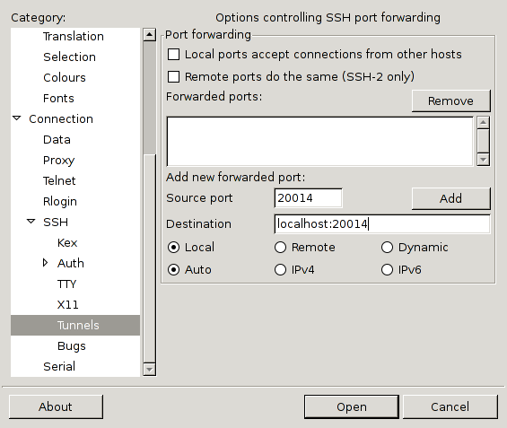

Hallgatói útmutató a SOA méréshez

Környezet kialakítása a Rapid szerveren
=======================================

A minta alkalmazás a következő módon tölthető le és állítható be legegyszerűbben a Rapid szerveren, SSH kliensen (pl. PuTTY) keresztül történő belépés után.

	curl -L https://db.bme.hu/r/lab5soa.sh | sh

A fenti két parancs lefuttatása után az aktuális könyvtárban létrejön egy `soa` nevű, mely tartalmazza a példakód legfrissebb verzióját. Ennek futtatásához az Oracle szerverhez való kapcsolódás paramétereit kell még beállítani. A `soa` könyvtárba belépve a `config.sample.json` állományt kell lemásolni `config.json` néven, és ebben a minta alapján már egyértelmű, hova kell beírni a felhasználónevet és jelszót. A `host` paraméter módosítása csak akkor szükséges, ha nem a Rapid adatbázisát szeretnénk használni, tehát legtöbb esetben figyelmen kívül hagyható.

Szolgáltatás futtatása a Rapid szerveren
========================================

Szolgáltatás elindítása
-----------------------

A `soa` könyvtárba belépve a `./run.sh` parancsot kiadva a következőhöz hasonló két sornak kell megjelennie.

	 * Running on http://127.0.0.1:20014/
	 * Restarting with stat

A `run.sh` szkript két dolgot tesz:

 * beállítja a futtatási környezetet az Oracle kliens programkönyvtárak eléréséhez: `export LD_LIBRARY_PATH=/usr/local/oracle/instantclient_12_2`
 * elindítja a `python service.py` parancs segítségével a szolgáltatást.

A felső sor tartalmazza a felhasználónkhoz rendelt egyedi portszámot (itt 20014), az alsó pedig azt, hogy a `reloader` funkcionalitás is aktív, mely a forráskód változtatása esetén újraindítja a szolgáltatást, hogy a legfrissebb változat legyen elérhető. A szolgáltatás a `Ctrl` + `C` gombok lenyomásával leállítható, illetve ha olyan problémába ütközik újratöltéskor, amitől nem tud újraindulni (például szintaktikai hiba), akkor a hiba kijavítását követően kézzel kell ismét elindítani. (Tipp: a felfelé mutató kurzorgombot használva gyorsan visszahívható a legutoljára kiadott parancs, így nem kell feleslegesen gépelni.)

A futó szolgáltatás leggyorsabban a Rapidon, például másik SSH kliensből (PuTTY ablakból) tesztelhető, a fenti példánál maradva a következő módon próbálható ki a segédletben is említett cURL klienssel a személy szolgáltatás.

	[vsza@off ~]$ curl http://127.0.0.1:20014/szemely/22406199243.json
	{
	  "nev": "V\u00e9gh Kl\u00e1ra",
	  "links": [
	    "http://learning.blogs.nytimes.com/on-this-day/June-19",
		"http://news.bbc.co.uk/onthisday/hi/dates/stories/june/19",
		"http://www1.sympatico.ca/cgi-bin/on_this_day?mth=Jun&day=19"
	  ]
	}

Szolgáltatás elérése helyi gépen futó böngészőből
-------------------------------------------------

Természetesen ezzel például az AJAX funkcionalitás nehezen lenne tesztelhető, így saját gépről is el lehet érni a szolgáltatást. Ehhez az SSH kliens ún. port forwarding szolgáltatását érdemes igénybe venni, ez általában kliensfüggő módon oldható meg. A példákban a fenti _20014-es portot használom, ez értelemszerűen cserélendő minden esetben._ A port forward elkészülte után a helyi gépen is elérhető a szerveren futó szolgáltatás az induláskor kiírt URL-en, azaz a fenti példában a `http://127.0.0.1:20014/` címen.

### PuTTY esetén ###

Amennyiben a továbbítandó port száma csatlakozás előtt ismert, a beállító ablakban a baloldali listában a *Connection > SSH > Tunnels* elemet kell kiválasztani (lehet, hogy ehhez "ki kell nyitni" megfelelő ágakat, ill. görgetősávot kell használni a betű- és ablakméret függvényében). Itt az *Add new forwarded port* részben a következő módon töltsük ki a mezőket:

 - Source port: 20014 (a saját portunk)
 - Destination: localhost:20014 (a saját portunk, előtte a `localhost:` szöveggel)
 - Local/Remote/Dynamic: Local (ha nem ez lenne az alapértelmezett)
 - Auto/IPv4/IPv6: Auto (ha nem ez lenne az alapértelmezett)

Ezt követően az *Add* gombra kattintva a port bekerül a *Forwarded ports* listába, és csatlakozhatunk a rendszerhez. Az "eredeti" fülhöz a baloldali listában a *Session*-t választva juthatunk vissza, itt a *Saved Sessions* részben el is menthetjük a kapcsolat paramétereit, így nem kell minden alkalommal beállítani újra. (A példaalkalmazás felhasználóhoz köti a portot, tehát ha már megtudtad a portod számát, következő bejelentkezésekkor is ugyanaz marad.)

Amennyiben csatlakozást követően derül ki a portszám, ugyanez az ablak előhozható az ablak fejlécén való jobb gombbal történő kattintással, majd a megjelenő menüben a *Change Settings...* lehetőséget választva, és a fenti módon megoldható a port forward beállítása.

### OpenSSH esetén ###

Amennyiben a továbbítandó port száma csatlakozás előtt ismert, egyszerűen az `-L 20014:localhost:20014` paramétert kell csak megadni az `ssh` parancsnak. Amennyiben csatlakozás után derül ki a portszám, Enter gomb lenyomását követően `~C` (hullámvonal majd Shift-C) szekvenciára egy `ssh>` promptot kapunk. Ez az OpenSSH belső promptja a program viselkedésének futás közbeni befolyásolására, itt már csak a fenti módon kell megadni a forwardoláshoz a paramétert, melynek elfogadását az OpenSSH vissza is jelzi, mint az az alábbi példában látható.

	$ ssh rapid
	Last login: Tue Apr 16 15:18:03 2013 from vsza.hu
	[vsza@off ~]$ 
	[vsza@off ~]$ 
	ssh> -L 20014:localhost:20014
	Forwarding port.

A második `[vsza@off ~]$` az Enter gomb lenyomásának hatására jelent meg, erre azért van szükség, mert a `~` jellel kezdődő ún. escape szekvenciákra ilyenkor figyel az OpenSSH. Ezt követően a `~C` karakterek nem jelennek meg már a kimeneten, mivel ezeket az OpenSSH belső folyamata elkapja, a többi escape szekvenciájáról a [hivatalos dokumentációban][sshdoc] lehet olvasni, a `C` a command line-t jelöli.

Beadandó anyagok
================

Az elvárt formátum, a korábbi mérésekhez hasonlóan, kötött. A beadott tömörített állományban az alábbi könyvtárstruktúrát várjuk el:

	NEPTUN-4-CSOPKOD.zip:
		NEPTUN-4-CSOPKOD/
			NEPTUN-4-CSOPKOD.pdf
			soa/
				service.py
				config.json
				static/
					feladatnev.html
					...

Természetesen a `soa` könyvtáron belüli fájlnevek feladattól és megoldástól függően eltérőek lehetnek, a lényeg, hogy a könyvtárat kicsomagolva működő Flask webszolgáltatást valósítson meg a `service.py` indításával a forráskód.

Értékelés
=========

Ponthatárok
-----------

A pontok megoszlása a feladatcsoportok között a következő:

 - Kötelező: 6 + 4 + 4 (14)
 - Válaszható: 8 + 9 + 9 (26)
 - Gondolkodtató: 15 + 10 + 8 (33)

Összesen 73 pont szerezhető pluszpontok nélkül, ennek megfelelően a ponthatárok a következő módon alakulnak:

 - __1__ [0 ... 12)
 - __2__ [12 ... 23)
 - __3__ [23 ... 34)
 - __4__ [34 ... 40)
 - __5__ 40 és afelett

Értékelési szempontok
---------------------

 - A szintaktikai hibát tartalmazó forráskód nem értékelhető.
 - A megoldásnak futnia kell a kiadott (`https://db.bme.hu/r/sql/<FELADATKÓD>.sql` szkript által létrehozott) mintaadatbázison, működéséhez nem igényelhet egyéni adatbázis objektumokat (nézetek, tárolt eljárások, stb.). Ennek biztosítására érdemes – a feladatlap fejlécében is szereplő útmutatást követve – a fejlesztés megkezdése előtt lefuttatni az említett szkriptet.
 - A megoldásnak futnia kell tetszőleges környezetben, különös tekintettel az adatbázis sémákra és az URL-ekre. Ennek megfelelően pontlevonás jár explicit sémanév (helytelen: `NEPTUN.jaratok`, helyes: `jaratok`) használatáért SQL lekérdezésekben, valamint hosztnév és portszám forráskódba való „bedrótozásáért” (helytelen: `{url: "http://127.0.0.1:20821/jaratok.json"}`, helyes: `{url: "/jaratok.json"}`) – ezek nehezítik az értékelést, és az iparban is rossz gyakorlatnak számítanak. Ilyen hibák a teljes pontszám 20%-áig terjedő levonással járnak.
 - Szerepeljen a jegyzőkönyvben egyértelműen minden feladatnál, hogyan lehet kipróbálni a feladat által kért implementációt. Minden feladatnál releváns legalább egy URL, böngészőben történő tesztelésnél képernyőfotó, `POST/PUT/DELETE` kéréseknél cURL parancssor, kimenettel. __Ezek hiányában a feladat nem értékelhető, arra 0 pont adható.__
 - A Rapidon `pylint` parancsként elérhető [Pylint][pylint] értékelése szerint 8 pontnál többet elérő forráskódot plusz ponttal jutalmazzuk, ha a jegyzőkönyv pontszáma enélkül is meghaladja a 20-at. A statikus kódanalízis hiányosságai miatt fellépő „fantomhibákat”, pl. `cx_Oracle` szerinte hiányzó osztályait nem vesszük figyelembe.
 - A nem oktatott, de a kódot olvashatóbbá, egyszerűbbé, "Pythonic"-abbá tevő megoldások szintén plusz pontot érnek, néhány lehetőségre a [példaprogram][demo] is rámutat.
 - A megoldás __egyetlen Python modulból álljon__ melynek neve a _Beadandó anyagok_ bekezdésben írtakkal összhangban `service.py` legyen. A modulon belül az alkalmazás objektum neve maradjon `app`, ennek megváltoztatása esetén a megoldás nem értékelhető.
 - A Python modul tartalmazzon modulonként és függvényenként egy fejkommentet, mely leírja az adott modul/függvény feladatát. Ezek megadásának módja a [példaprogramban][demo] is megtekinthető, hiányuk esetén -2 pont a feladatnál elért pontszámból.
 - A hivatkozás nélkül átvett kódrészleteket másolásnak tekintjük, és ez esetben a teljes a mérést sikertelennek nyilvánítjuk. Ha bizonyíthatóan egy másik hallgatóról másoltál, akkor féléved érvénytelen. Egyedül a segédlet kódrészletei és a [kiadott példaprogram][demo] használható fel hivatkozás nélkül.
 - Választható és gondolkodtató feladatra csak akkor adható pont, ha a kötelező feladatok mindegyikére adtál (nem feltétlen hibátlan) megoldást.
 - Paraméteres SQL utasítások használata javasolt, ahogy az a segédletben látható példákban is szerepel. Az SQL-be szövegesen behelyettesített paraméterek használata biztonsági rést eredményez az alkalmazásban, így a feladatért járó pontszám 50%-ával felérő levonással "jutalmazandó".
 - Az adatok feldolgozását (pl. szűrés, illesztés) lehetőleg szerver oldalon – SQL által – végezzük.
 - A JSON szótárak bejegyzéseinek sorrendje tetszőleges lehet, a Python `dict` implementációja folytán nem determinisztikus kulcs-sorrendért nem vonunk le pontot.

Mit tegyek ha?
==============

 - `Socket.error: [Errno 98] Address already in use` __üzenetet kapok indításkor.__ Mint a hibaüzenet is utal rá, valami már foglalja a neked kijelölt portot. Mivel mindenkinek egyedi portot jelöltünk ki, hacsak valaki nem rosszindulatú, valószínűleg egy saját processzedről van szó. A `ps ux` parancs kiadásával megnézheted a te felhasználódhoz köthető folyamatokat, a PID oszlopban látható ID alapján pedig kilőheted – ha fut már egy szolgáltatásod, de nincs hozzá nyitva konzolod – a `kill <pid>` paranccsal vagy `pkill python` kilövi automatikusan az összes, általad indított Python folyamatot.
 - `TypeError: fuggvenyneve() got an unexpected keyword argument` __üzenetet kapok egy új végpont meghívásakor.__ Az ilyen hibák leggyakoribb oka, hogy úgy copy-paste-eltél egy korábbi végpontot, hogy a függvény neve maradt a régi, így a Python futtatókörnyezet mindkét végpontot ugyanahhoz a függvényhez rendeli, amely közül az egyik lehet, hogy nem vár paramétert. Ellenőrizd, hogy minden függvény neve egyedi legyen!
 - __A JSON kimenetemben „nem jók” az ékezetes karakterek, helyettük `\u00dc` jellegű kód jelenik meg.__ A JSON kimenet ideális esetben csak ASCII karaktereket tartalmaz, így az ékezetes betűket a legtöbb könyvtár Unicode escape szekvenciákkal helyettesíti (az u betű után a Unicode kódpont értéke szerepel hexadecimális formában). Ez nem gond, a JSON kimenet nem emberi, hanem gépi felhasználásra készül.
 - __Nem tudok belépni a rapid-ra.__ Ellenőrizd a felhasználói nevedet, jelszavadat és a billentyűzet kiosztását. Jelezd a problémát a mérésvezetődnek, ő továbbítja a kérésedet (új jelszót kérsz) a rendszergazdának.
 - __Rapidon cURL-lel elérem a szolgáltatást, de helyi gépen nem, pedig a forwardot megcsináltam.__ Ellenőrizd, nem okoz-e gondot a helyi tűzfal, engedélyezd benne az SSH kliens (pl. PuTTY) számára a forgalmat.
 - __Nem működik a Python/Flask megoldásom, kivételt kapok.__ A debugger egyrészt tartalmazza a teljes hívási vermet, itt érdemes a legutolsó olyan elemet megkeresni, amelyet a te kódod hív, valószínűleg itt van a hiba.
 - __Nem működik az AJAX megoldásom.__ A hallgatói segédlet tartalmazza a Google Chrome böngésző debuggerének használatát, próbáld meg ezzel behatárolni a hiba helyét.
 - __Egyszer csak elérhetetlenné vált az alkalmazásom.__ Ellenőrizd az SSH kliensben (PuTTY), hogy nem állt-e le a szolgáltatás olyan hiba miatt, amit magától nem tudott orvosolni (pl. szintaktikai hiba). A hibaüzenet alapján szüntesd meg a hiba forrását, majd indítsd újra a szolgáltatást.
 - __Hiába használok `abort(státuszkód)` hívást, a megadottól eltérő státusza lesz a válasznak.__ Az `abort` belső működése [kivételeket használ][werkzeug-abort], ezért ha azt bárhol körülveszi egy `try ... except` blokk, amely minden kivételt elkap (ún. _catch-all_, nem definiál konkrét kivételosztály(oka)t), akkor a te kivételkezelőd „elkapja a Flask elől” az ő belső használatra szánt kivételét, ezért nem a várt viselkedést produkálja a kódod. A helyes megoldás mindig a lehető leginkább specifikus kivétel (ős)osztály megadása `try-except` szerkezet esetén.

Függelék: `cx_Oracle` telepítése saját környezetbe
==================================================

A hivatalosan támogatott módja a labor elvégzésének a Rapid használata, azonban
saját felelősségre természetesen telepíthet bárki `cx_Oracle` környezetet
kísérletezés és testreszabhatóság céljából. Az alábbiakban bemutatott módszer
Debian GNU/Linuxon került kipróbálásra sikeresen Oracle Instant Client 12.1.0.2.0
verzióval, de más környezetekben is alkalmazható, értelemszerű változtatásokkal.

Függőségek telepítése
---------------------

A következő, Debian/Ubuntu csomagnévvel azonosított függőségek szükségesek a
telepítés megkezdéséhez:

 - `python`
 - `python-dev`
 - `python-pip`
 - `python-wheel`
 - `gcc`
 - `libaio1`

Ezen kívül szükséges még az Instant Client letöltése a megfelelő architektúrára
(tipikusan [x86][instaclient32] vagy [x86-64][instaclient64]), ezen belül a
Basic-re és az SDK-ra van szükség. Basic-ből elég a Lite is, ha nem akarunk
magyar nyelvű üzeneteket.

A letöltéshez szükséges a felhasználói feltételek elfogadása, majd belépés
OTN felhasználóval, ez megtalálható az Oracle laborhoz adott segédletekben.

A letöltés eredménye két ZIP fájl, ezeket tetszőleges könyvtárba ki kell
csomagolni, majd

 - szimbolikus linket kell készíteni a `libclntsh.so.12.1` fájlra
   `libclntsh.so` néven, és
 - a könyvtár abszolút útvonalát el kell tárolni az `ORACLE_HOME` és
   `LD_LIBRARY_PATH` környezeti változókban a következő lépéshez használt
   shell környezetben.

`cx_Oracle` telepítése és használata
------------------------------------

A fentiek sikeres megtörténtét követően `pip install cx_Oracle` paranccsal
telepíthető maga a Python modul, amely az Instant Clienthez linkelve, annak
SDK részeit fejlécként használva fordít egy natív Python kiterjesztést.

Sikeres telepítés esetén a kimenet utolsó sorai az alábbihoz hasonlók:

	Successfully built cx-Oracle
	Installing collected packages: cx-Oracle
	Successfully installed cx-Oracle-5.2.1

Ezt követően a modul használható, de mindenképp szükséges a Python interpreter
indítása előtt az `LD_LIBRARY_PATH` környezeti változóban elhelyezni az
Instant Client kitömörítésekor létrehozott könyvtárat (az `ORACLE_HOME`
tapasztalatunk szerint nem szükséges). A Rapidon alkalmazott megoldás a
shell indulásakor automatikusan beállítja ezt, de természetesen külön shell
script is létrehozható a `service.py` indításához, amely közvetlenül a
szolgáltatás indítása előtt végzi el a beállítást.

Docker és PyCharm használata
----------------------------

Egy hallgatónk, Rehó Balázs készített egy [alternatív útmutatót][rehobalazs-howto],
amely szövegszerkesztőnek a PyCharm IDE-t használja, a szükséges függőségek
operációs rendszertől kezdve a Python környezeten át a `cx_Oracle` könyvtárig
előre összeállított Docker konténerben kerülnek összeállításra.

**Természetesen ehhez az útmutatóhoz szintén nem tudunk támogatást adni, és mint
Balázs is fogalmaz a bevezetőben, a munka gyorsítása helyett adott esetben
a feladatok megoldása elől veheti el az időt. Így csak tapasztaltabb,
kísérletező kedvű hallgatóknak javasoljuk kipróbálását a fentiek tudomásulvétele
mellett.**

  [sshdoc]: http://man.openbsd.org/OpenBSD-current/man1/ssh.1#ESCAPE_CHARACTERS
  [pylint]: http://www.pylint.org/
  [demo]: https://github.com/adatlabor/soa-demo
  [instaclient32]: http://www.oracle.com/technetwork/topics/linuxsoft-082809.html
  [instaclient64]: http://www.oracle.com/technetwork/topics/linuxx86-64soft-092277.html
  [rehobalazs-howto]: https://gist.github.com/balazsreho/1c60ec84408193dd1da94ab34b28e11f#file-szl5-soa-docker-md
  [werkzeug-abort]: https://github.com/pallets/werkzeug/blob/ec55428/werkzeug/exceptions.py#L636-L661
