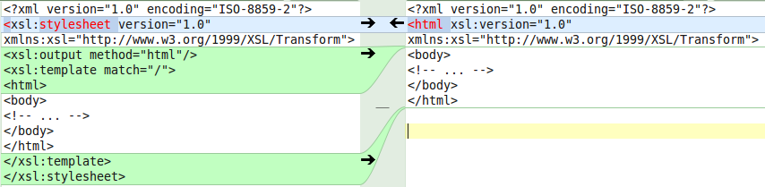



 Az 5. labor [felkészülési anyaga](hallgatoi-segedlet-xml2017.pdf).

 - [Hallgatói útmutató](xml-hallgatoi-utmutato)
 - [Jegyzőkönyv írási tudnivalók és sablonok](/jegyzokonyv/tudnivalok/)
 - [Példaprogram](https://github.com/adatlabor/xml-xslt-demo)
 - [XHTML címkék](xhtml_fuggelek.pdf)
 - Kiegészítés a hallgatói segédlethez. Az alábbi ábra kiemeli az egyetlen, a gyökérelemre illeszkedő sablont tartalmazó XSL stíluslapok egyszerűsített és normál írásmódja közötti különbséget.
   
