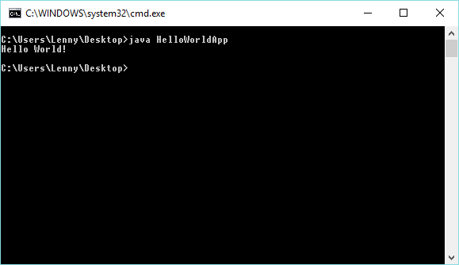

## Tudnivalók a laborokban végzett munkáról készítendő dokumentum elkészítéséhez

Az adatbáziskezeléshez kapcsolódó, különböző laborokban végzett munkáról nem egy típusjegyzőkönyv, hanem egy minden hallgató számára egyedi dokumentum készítendő, amely a hallgató saját megoldásmenetét, egyedi megoldásait kell, hogy tartalmazza ("szerzői mű"). Az oktatás sajátosságai miatt a különböző hallgatók dokumentumainak lesznek közös tartalmi és formai elemei, amelyek betartásához sablon fileok szolgálnak segítségül.

Sablonok:
[doc](../doc-sablon.doc)
[docx](../docx-sablon.docx)
[odt](../odt-sablon.odt)
[rtf](../rtf-sablon.rtf)
[LaTeX](../tex-sablon.tex)

1. **Az alábbi szabályok be nem tartása pontlevonással, vagy a laborban végzett munka elutasításával járhat.**
2. A dokumentum fejlécében minden adat pontosan és helyesen kitöltendő.
3. A feladat szövegét a dokumentum ne tartalmazza!
4. A nem megoldott feladatok sorszámát ki kell törölni. A feladatok sorszáma egyezzen meg a kiadott feladatsorban található sorszámokkal!
5. A vélemény rész csak vélemény írása esetén szerepeljen, különben ez is törlendő.
6. Hivatkozások (link, képek, forráskód):
    -	A hivatkozásokat tedd lábjegyzetbe! A plágiumvád elkerülése érdekében **mindennek** megjelölendő a forrása, ami nem saját alkotás (pl.: Stackoverflow), ez alól csak a hivatalosan kiadott anyagok tartalma képez kivételt.
    -	A képeket a magyarázat közelébe (pl. elé vagy alá) helyezd el! Amennyiben ez nem lehetséges, akkor adj nekik sorszámot és/vagy címet, és úgy hivatkozz rá!
        -	Csak jó minőségű, könnyen olvasható képeket helyezz el a dokumentumban!
    - Forráskód, parancssori művelet ill. ezek szöveges kimenete, ha szükséges a megoldás dokumentálására, akkor szöveges tartalomként jelenjen meg a dokumentumban. Csak képként beszúrva nem elfogadható!
    - Lehet hivatkozni a forrásra fájlnév/sor módon is, de be is másolhatók a releváns részletek. A forráskódot a magyarázat közelébe (pl. elé vagy alá) helyezd el! Az egész forráskódot nem szabad/felesleges bemásolni a dokumentumba, mert a forrásfájlokat úgyis mellékelni kell.
      - A kód igényesen formázandó, ehhez segítség pl. itt  http://hilite.me/ található.
7. Magyarázat:
    -	Magyarázat nélküli képeket, forráskódokat ne hagyj a dokumentumban, mert ezt úgy veszik a javítók, mintha ott sem lenne:
        - Kép esetében írd le, hogy mi látható a képen!
        - Forráskód esetén írd le, hogy mit csinál (szerinted) az adott kódrészlet!
    -	A magyarázatban szerepeltesd, hogy miképpen jutottál el a megoldásig!
        - Ha esetleg valamit kipróbáltál, de nem működött, az is dokumentálható, hiszen ez is a feladat megoldásához vezető út része volt.
        - Figyelj a helyesírásra, a szakmaiságra és a könnyen érthető megfogalmazásra, mert a cél az, hogy az értékelőt meg tudd győzni a feladat megoldásáról, annak megalapozottságáról, helyességéről! A leírtak alapján a munka reprodukálható kell, hogy legyen.
    -	A működést a tesztelés részletezésével kell bizonyítani, mert enélkül úgy tűnhet a javító számára, hogy az elkészült programot, szkriptet kipróbálás nélkül adtad be.
        - Ahol a feladat kéri, ott mintaadatokat is adj meg, amivel a javító is tesztelhet.
8. A dokumentumot olyan pdf formátumban kell beadni, amiből minden szöveges tartalom könnyen kinyerhető. Az egyéb fájlformátumokat a javítók nem fogják elfogadni.
9. A dokumentumot az útmutatóban szerepeltetett kiírás figyelembevételével kell feltölteni.
    - A fájlok neveit célszerű gondosan ellenőrizni, mert a fájlokat feldolgozó programok csak a megadott inputot fogadják el.

 


## Minta a dokumentumhoz

### 1. Feladat (mintamegoldás)

A feladat megoldásához le kellett kérnem az adatbázisból a megfelelő rekordokat. Ehhez a következő SQL utasítást használtam:
``` SQL
SELECT nev, cim FROM ember WHERE kor = 54
```
Ezzel az utasítással kiválasztom azokat az embereket, akik 54 évesek, majd lekérem a nevüket és a címüket.

Ezután a Java kódot készítettem el. Ehhez a HelloWorldApp.java fájl HelloWorldApp osztály main metódusában végeztem el a kezdeti módosításokat, ez a fájl 31. sorában található.
``` java
    public static void main(String[] args) {
        System.out.println("Hello World!");
    }
```

A metüdus kiírja a megadott sztringet.

A tesztelés során lefuttattam a programot. Az alábbi képen látszik, hogy az elkészült program az elvárt kimenetet adja.


